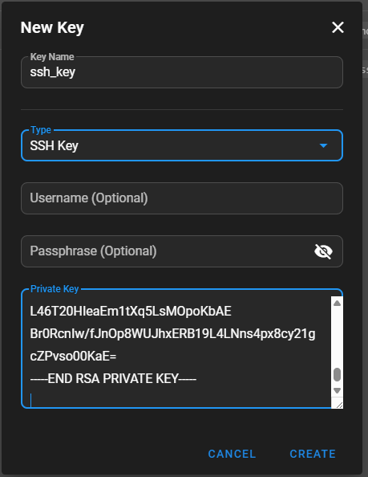
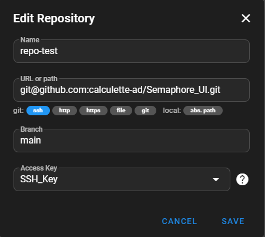
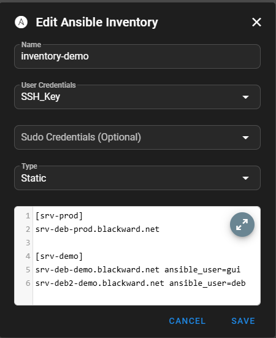
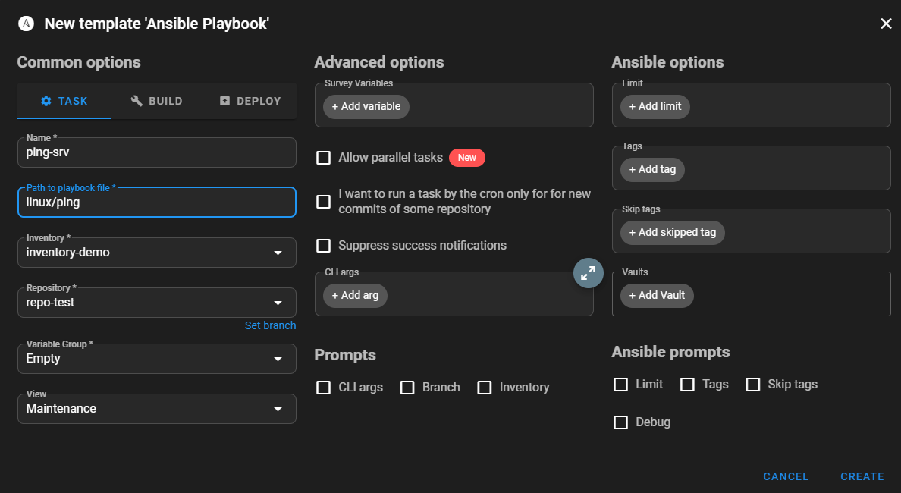
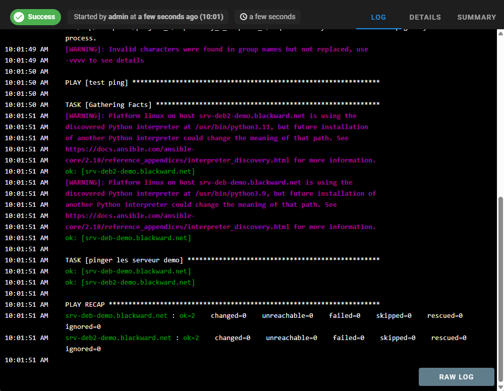
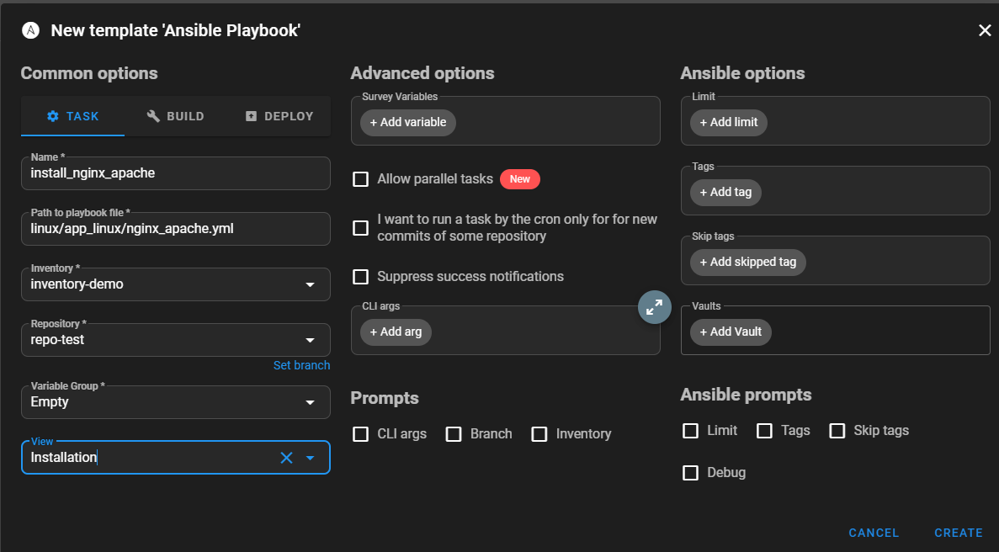
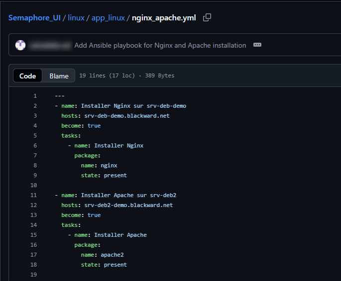
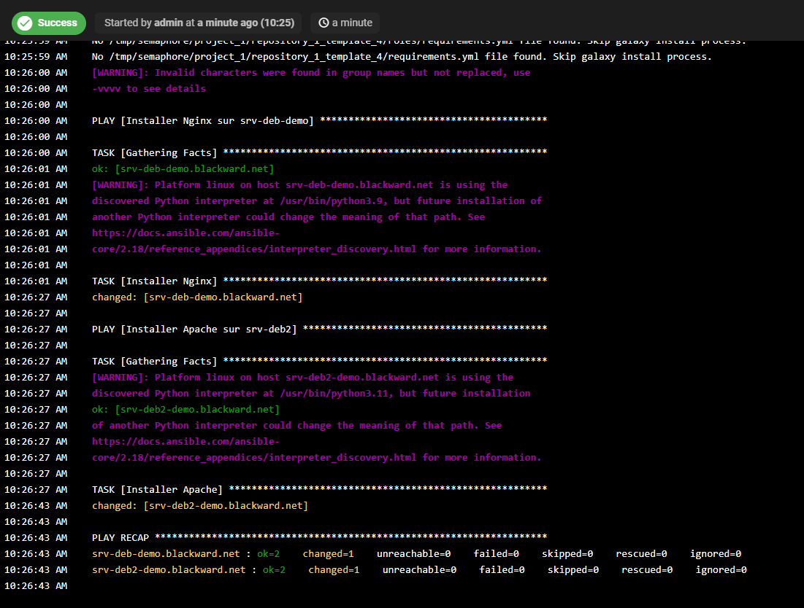
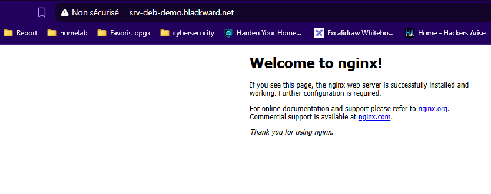
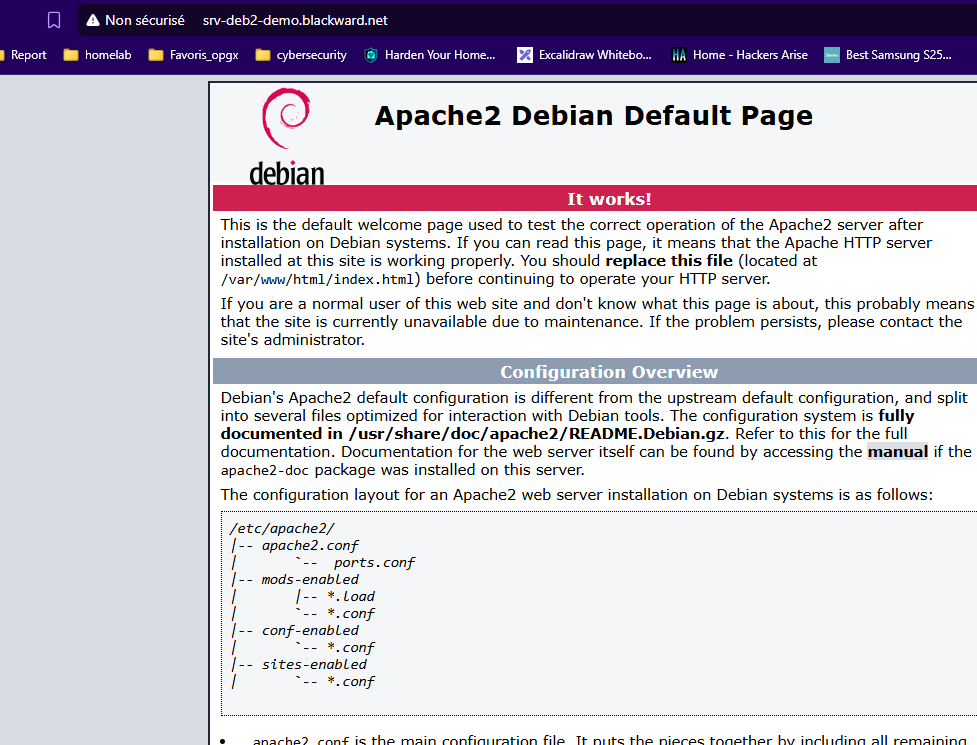

# 🚀 Semaphore - Interface Web pour Ansible

**Semaphore** est une interface web légère permettant d'exécuter et gérer des **playbooks Ansible** facilement.

Ce guide décrit comment déployer Semaphore avec **Docker Compose**, connecté à une base **MySQL**.

## 📋 Prérequis

Avant de commencer, assurez-vous d'avoir :

- 🐧 Un serveur Linux (Ubuntu/Debian/CentOS)
- 🐳 **Docker** et **Docker Compose** installés
- 📦 Accès root ou sudo sur le serveur
- 🔧 Au moins 2GB de RAM disponibles

### Vérification de l'installation
```bash
docker --version
docker-compose --version
```
### 📁 Structure du projet

Voici l'arborescence du projet :

```bash
semaphore/
├── docker-compose.yml      # Stack Docker
├── .env                    # Variables d'environnement
├── inventory/              # Dossiers pour les inventaires Ansible
├── semaphore_data/         # Données persistantes de Semaphore
└── semaphore_config/       # Fichiers de configuration
```
## 🐳 Déploiement avec Docker Compose

1. Démarrage des services
```bash
docker-compose up -d
```

2. Vérification du statut
```bash
docker-compose ps
```

🧩 7️⃣ Configuration post-installation
Connectez-vous avec les identifiants admin définis dans .env.
Créez un projet (ex : homelab)
Créer un une nouvelle clé



Crée un repositories GitHub ou GitLab



Ajouter un fichier Inventory



Créer Task 

Ce task a pour but de tester un ping sur les serveurs




Résultat du test ping 



NB : Assurez-vous d’avoir python installer sur vos machines cibles

```bash
sudo apt update
sudo apt install python3 python3-venv -y
```

Un autre exemple qui consiste a déployer nginx et apache respectivement sur nos 2 serveurs



Dépôt GitHub



Résultat  exécution



[demo_nginx](http://srv-deb-demo.blackward.net/)



[demo_apache](http://srv-deb2-demo.blackward.net/)



## 📚 Ressources utiles

-`[Documentation Semaphore](https://semaphoreui.com/docs)`
-`[Guide Ansible](https://docs.ansible.com/)`
-`[Docker Documentation](https://docs.docker.com/)`
